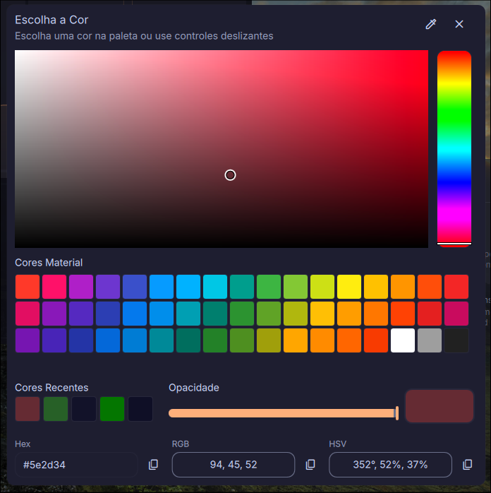

<div align="center">


[](https://github.com/bernardopg/color-picker-dms/actions/workflows/ci.yml)
[](https://github.com/bernardopg/color-picker-dms/releases)
[](LICENSE)
[](https://crowdin.com/project/color-picker-dms)



</div>

## ✨ What It Does

Color Picker DMS is a DankMaterialShell plugin that lets you pick colors from the screen and copy them in various formats. It provides a quick-pick pill for instant color capture, a right-click menu for common actions, and a full-featured popout workbench for manual picking, conversion, palette management, and contrast checking.

## Features

- DankBar pill quick-pick.
- Right-click DankBar pill menu:
  - pick color with the eyedropper
  - copy last color
  - copy HEX
  - copy RGB
  - copy all formats
  - add current color to palette
  - copy palette
  - open the workbench
- Control-center widget and detail view.
- Popout workbench with:
  - screen color picking
  - copy HEX, RGB, HSL, HSV, and CMYK
  - persistent palette
  - manual color converter
  - WCAG AA/AAA contrast checker
- Settings for default format, backend, auto-copy, lowercase hex, and language.

## Requirements

Required:

- DankMaterialShell >= 0.1.18
- `wl-copy` from `wl-clipboard` for clipboard copy

Capture backend: install at least one of:

- `hyprpicker`
- `grim` + `slurp` (`magick`/ImageMagick improves fallback reliability)
- DMS native `dms color pick`

## Install

##### Option 1

Download directly from the [DankMaterialShell Plugins](https://danklinux.com/plugins) page <https://danklinux.com/plugins>

##### Option 2

Download the latest release and extract the `colorPicker` folder into your DMS plugins directory:

```bash
mkdir -p ~/.config/DankMaterialShell/plugins/colorPicker
unzip color-picker-dms.zip -d ~/.config/DankMaterialShell/plugins/colorPicker
chmod +x ~/.config/DankMaterialShell/plugins/colorPicker/capture/pick-color
dms restart
```

##### Option 3

Clone into the DMS plugins directory:

```bash
git clone https://github.com/bernardopg/color-picker-dms.git ~/.config/DankMaterialShell/plugins/colorPicker
chmod +x ~/.config/DankMaterialShell/plugins/colorPicker/capture/pick-color
dms restart
```

Then enable the plugin in DMS settings or add it to your DankBar layout.

## Usage

- Left-click the DankBar icon to pick a screen color and auto-copy the configured format.
- Right-click the DankBar icon to open the quick actions menu.
- Open the plugin popout/workbench to copy any format, add the current color to the palette, convert typed colors, or inspect contrast.
- Configure the default copy format and backend from plugin settings.

<div align="center">

## 💜 Support

If Color Picker DMS helps your DMS setup, you can support ongoing maintenance through GitHub Sponsors:

[](https://github.com/sponsors/bernardopg)

## 📄 License

Released under the terms in [LICENSE](./LICENSE).


</div>
